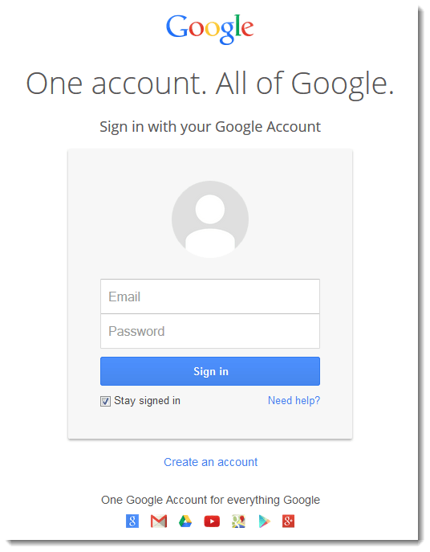

## Objetivo

1. Elige una web de tu preferencia y explica qué partes conforman el UX y qué partes el UI

## YOUTUBE
	```Youtube es la segunda red social con más usuarios
			de todo el mundo``

### UX

* La busqueda rapida para encontrar lo que estoy buscando
* Se tiene la opcion de suscribirse a diversos canales según los temas de interes.
* El usuario puede crear su canal subiendo sus propios contenidos en distintos formatos.
* Me permite compartir los videos en las redes sociales.

### UI

* Los videos se pueden adaptar a cualquier dispositivo.
* Opcion de subir anuncios de publicidad.





