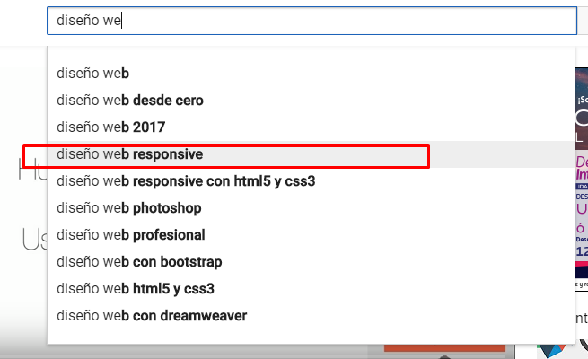

## Objetivo

1. Elige una web de tu preferencia y explica qué partes conforman el UX y qué partes el UI

## UX

* El usuario tiene que tener una cuenta para que tenga la opcion de acceder a todas las funcionalidades de YouTube.

